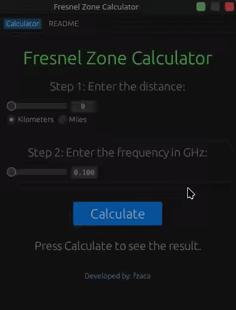

# Fresnel Zone Calculator


```
  ______                      _  
 |  ____|                    | | 
 | |__ _ __ __ _  ___ ___  __| | 
 |  __| '__/ _` |/ __/ _ \/ _` | 
 | |  | | | (_| | (_|  __/ (_| | 
 |_|  |_|  \__,_|\___\___|\__,_| 

   _____      _            _             
  / ____|    | |          | |            
 | |     __ _| | ___ _   _| |_ ___  _ __ 
 | |    / _` | |/ _ \ | | | __/ _ \| '__|
 | |___| (_| | |  __/ |_| | || (_) | |   
  \_____\__,_|_|\___|\__,_|\__\___/|_|   
```

This is a simple and intuitive application to calculate the Fresnel Zone for wireless communication. The application is built using Rust and `egui` for the graphical interface. It allows users to input the distance between two points and the frequency of the signal to calculate the Fresnel Zone, which is crucial for understanding potential signal interference.

## Screenshot



## How to Use

1. **Launch the Application:** Run the application and you'll be presented with a simple interface.
2. **Enter the Distance:** Input the distance between the two points. You can switch between kilometers and miles using the radio buttons.
3. **Enter the Frequency:** Input the frequency of the signal in GHz. The maximum allowed frequency is 50 GHz.
4. **Calculate:** Click the "Calculate" button to see the radius of the first Fresnel Zone in meters.


## Installation

You can easily install the Fresnel Zone Calculator by running the following command:

```sh
curl -sSf https://raw.githubusercontent.com/fzaca/fresnel_calculator/master/install.sh | sh
```

To build and run the application, you need to have Rust installed. Then, clone the repository and run the following commands:

```sh
cargo build --release
cargo run
```
